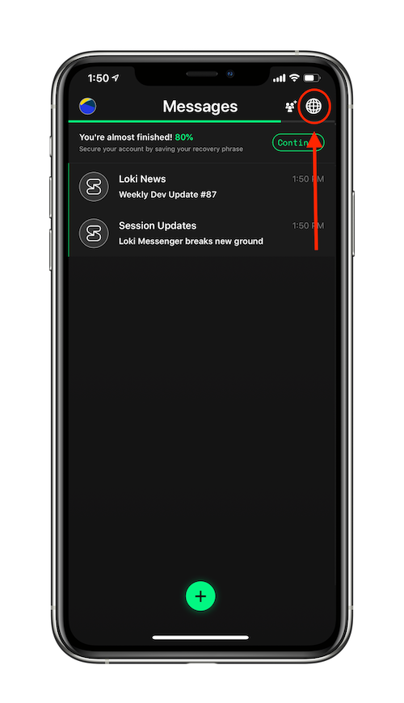
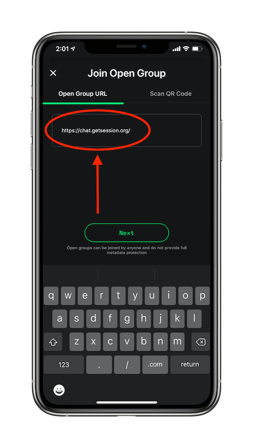
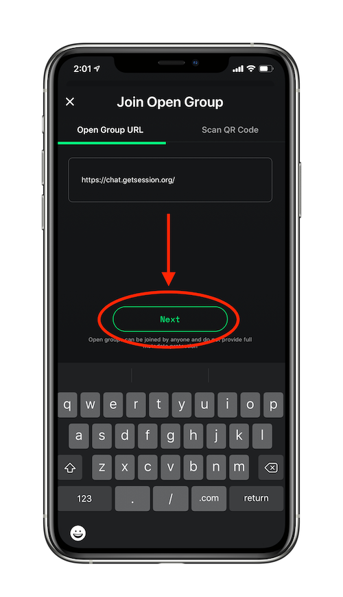
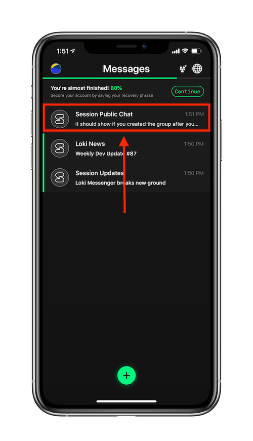

title: Lokiドキュメンテーション | セッションでオープングループに参加する方法：スマホのアプリ版 | 分散型メッセンジャー
description: セッションにおいて、オープングループはコミュニティーを設けるのに良い方法です。オープングループに参加する方法を学びましょう。

# セッションでオープングループに参加する方法（スマホのアプリ版）

* 地球儀アイコンをタップする。

* 参加したいオープングループのアドレス（URL)を入力する _(アドレスの初めに「https://」もお忘れなく！)_

* 「next」をタップする。

* セッションにおいて、新しいコミュニティーの一員として楽しもう！

