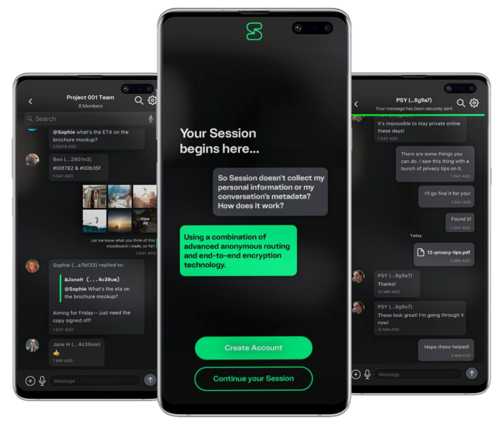

title: Lokiドキュメンテーション | セッション | 終端間（エンド・トゥ・エンド）暗号化されるプライベートな分散型メッセンジャー
description: Lokiネットワークに初めて実施されたサービスは「セッション」と呼ばれる終端間暗号化されプライベートな分散型メッセンジャーアプリです。

# セッション

[セッション](https://getsession.org) はオープンソース、公開鍵をもとにしたの安全なメッセンジャーアプリです。分散型の記憶サーバそして[オニオンルーティングプロトコル](../infrastructure/#onion-requests)によって、メタデータの暴露をできる限り防止しながら終端間暗号化されるメッセージを通信します。それに加えて、主流メッセンジャーアプリの共通の機能も提供します。

## ダウンロード

セッション公式サイトを訪れてアプリをダウンロードしましょう： 
[ダウンロード](https://getsession.org)

## セッションの名前を登録する

詳しくは「[セッション/ウォレット名前を登録する方法](../HowToRegisterSessionNames/)」を訪れる。

## 入門

この10年にわたってメッセンジャーアプリの使用が著しく増加しており、各々で広く使用されているアプリ群が10億人以上ものユーザー規模を実現していました。多くの人気アプリのプライバシーやセキュリティーにおける欠点もこれまでかなりの期間に渡り、話題になっていました。現在、ユーザーデータのプライバシーを保護する方法はメッセージ内容を暗号化することに集中し、ある程度成功していました。

終端間暗号化（E2EE）の幅広い利用は確かにユーザープライバシーを高めます。しかしながら、このアプローチは政府や企業によって、ユーザーの行動を追跡するためメタデータの利用に対処できません。プライベートなメッセンジャーの場合、メタデータは会話参加者のIPアドレスと電話番号、通信されたメッセージの数とタイミング、そしてアカウント間の関係の情報が含まれています。ますますこのようなメタデータの収集と分析はジャーナリスト、抗議者、そして人権活動家への深刻なプライバシー脅威となります。

大部分が、セッションはこの脅威に対する対策であり、既存プロトコル（プライベートな通信の提供を成功させた実績を持つSignalも含まれる）を基に断固たる[メタデータ保護](../infrastructure/)を実行しようとします。

セッションは幾つかの方法でメタデータの収集を軽減しています：

先ず、セッションが中央型サーバーに頼らず、何千もの経済的に[奨励された分散型ノード](../../../ServiceNodes/SNOverview/)のネットワークを[メッセージ交換の主な機能](../message_routing/)に使用します。分散化が実践的でない場合（例えば添付ファイルのストレージそれとも[大人数のチャットルーム](../group_chats/)）、ユーザーは自分のサーバーで必要なインフラをホストできます。また、アプリの内蔵暗号化やメタデータ保護に頼るという選択も可能です。

次に、セッションがIPアドレスは送られるメッセージとつながらないように、そしてさらに相手に受信されないよう安全性を確保します。これは「[オニオンリクエスト](../infrastructure/#onion-requests)」と呼ばれるオニオンルーティングプロトコルの使用で実現されます。

最後に、セッションではアカウント作成がメールアドレスや電話番号を必要としません。その代わりに、[匿名の公開鍵システム](../infrastructure/#identity-and-long-term-keys)をアカウント識別のための基準として使用します。

