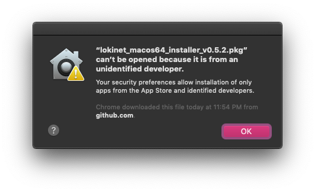
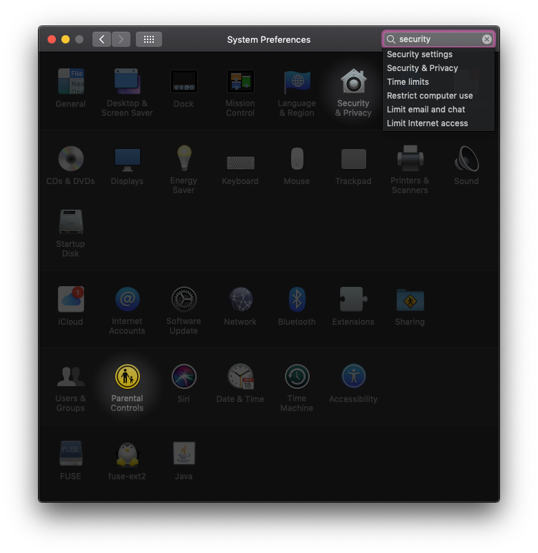
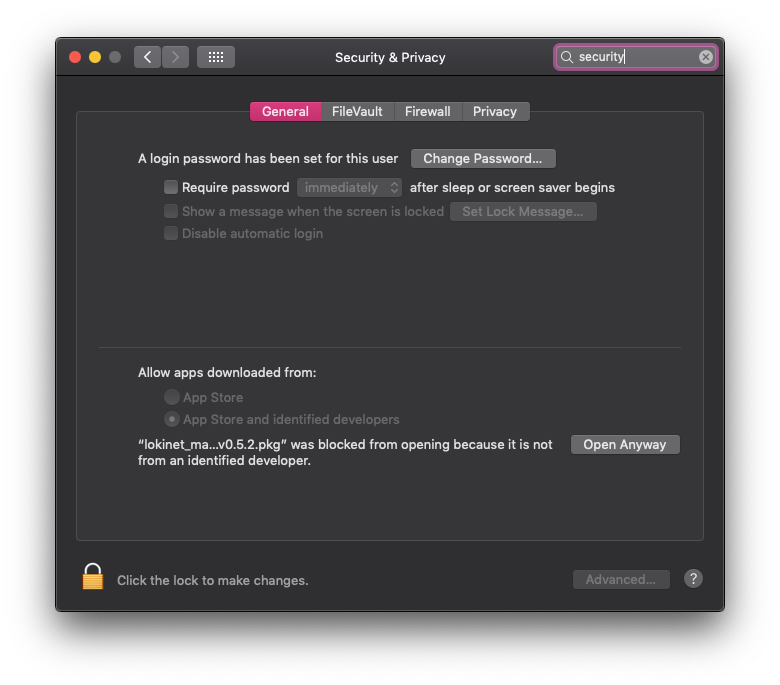
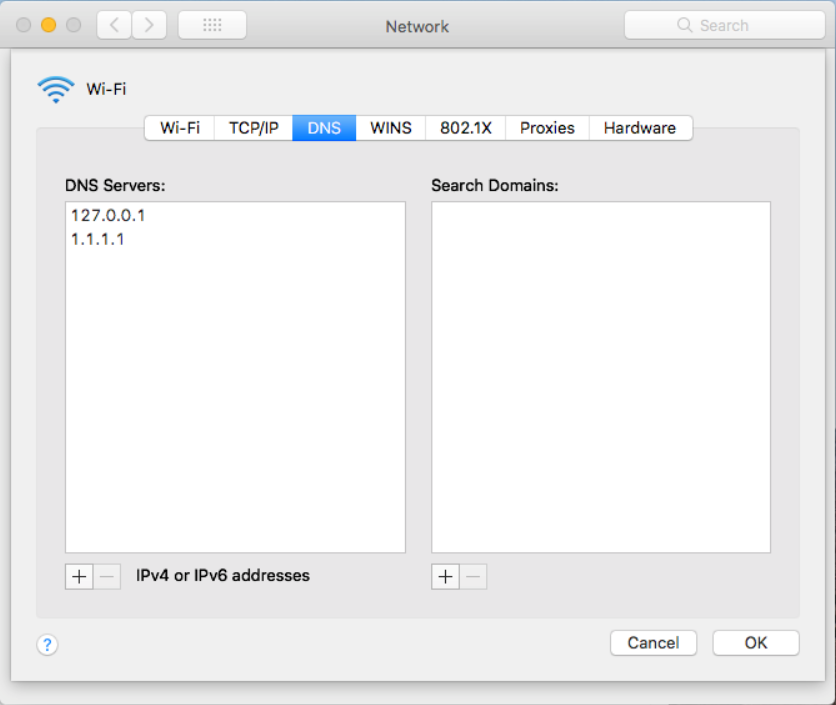

title：Lokiドキュメント | Lokinet MacOSインストールガイド | オニオンルーティング
description: このガイドで、耐シビル攻撃性を持つオニオンルーターのLokinetをMacOSでインストールして使えるようになります。

# Lokinetインストールガイド　-　MacOs

## 1. 最新のリリースをダウンロードする

[lokinet.org](https://lokinet.org/)にアクセスして、最新のMacOS Lokinetをダウンロードして実行します。

## 2. Lokinetソフトウェアをインストールする

### 2.1 許可

先ずは、ダウンロードしましたLokinet Macソフトウェアを実行してみて下さい。おそらくセキュリティーエラーが出るでしょう。



このエラーが表示される場合、システム設定を開いて、「セキュリティー」を検索してください。

そして「セキュリティーとプライバシー設定」を開きます。



ウィンドウーの一番下に、「実行」ボタンをクリックしてLokinet Mac pkgに許可を与える。



### 2.2 Lokinetをインストール

次はインストールを続けます。


## 3. ターミナルを開いてLokinetのMacOSバイナリーを実行します。

これでターミナルでlokinetを実行できます。：

```
sudo lokinet
```


## 4. DNSを設定

DNSは自動的に設定されない場合、手動で設定できます。

「システム設定　→　ネットワーク　→　詳細設定　→　DNS」を開きます。

DNSサーバーリストに、「＋」をクリックします。

DNSアドレスとして「127.0.0.1」を入力します：

> 注意点：LokinetのDNSアドレスを追加する時、デフォルトDNSサーバーの上にして下さい。
> 参考のため、下の画像を見て下さい。



---

## 5. トラブルシューティング
### .lokiアドレスにアクセスできない。

DNS設定の確認で解決できます。[ステップ 4](#4-configure-dns)を参照して下さい。

## 6. 完了！

おめでとうございます、ガイドをクリアしました。ここから[Lokinetパブリックテストのガイド](../PublicTestingGuide/#2-accessing-snapps)に戻りましょう。
