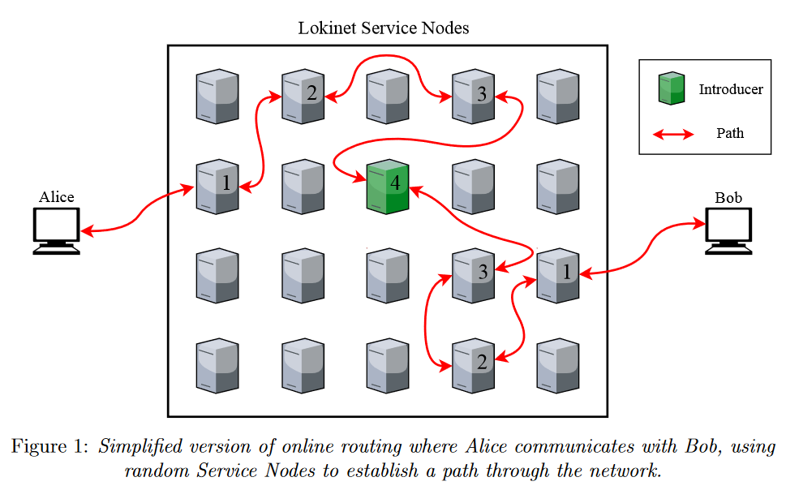
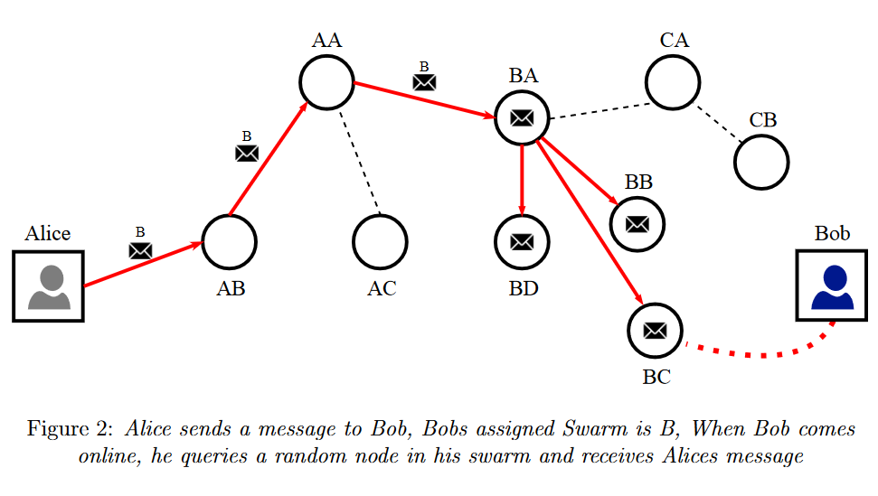

# Loki Messenger

The first Loki service to be developed and deployed on the Loki network will be a decentralised, end-to-end encrypted private messaging application called Loki Messenger.

End-to-end encrypted messaging applications that provide a platform for users to send messages without revealing their contents already exist, however they rely on centralised servers that can be targeted, blocked and shut down.  These  centralised  service  models present a high-risk for the anonymity of communicating parties, as they often require the user to register a phone number or other identifying information and connect directly via the IP address of the user. This information could be extracted from servers through data leaks or legal processes and used against the user. Leveraging the [Service Nodes](../ServiceNodes/SNOverview.md) architecture on the Loki network, we can deliver a service similar to popular centralised encrypted messaging apps, such as Signal, with a higher degree of privacy and censorship resistance.

## Download Links

Head over to the Loki Get Started Page to get your Loki Messenger download Links: 
[Loki Get Started](https://loki.network/getstarted/)

## Messenger Routing

Message routing on the Loki network changes depending on whether the receiving user is online or offline.  When both users are online, higher bandwidth communications can take place due to the fact that messages do not need to be stored on the [Service Nodes](../ServiceNodes/SNOverview.md).

In Loki, a public key acts both as long-term encryption key and a routing address. In the most simple case, this key should be exchanged out-of-band to ensure protection against a man-in-the-middle attack. Such an exchange should take place either in person or through another secure mode of exchange.

### Online Messaging

Once Alice knows Bobs public key, she assumes he is online and tries to create a path to him. Alice does this by querying the DHT of any Service Node and obtains any introduction set that corresponds with Bobs public key.  In LLARP, introduction sets list the introducers that each user maintains.  It is through these introducers that paths can be established. With Bobs introducer, Alice now chooses three random Service Nodes to act as intermediary hops between her origin and her destination (Bobs introducer).  A path has now been established, through which Alice and Bob can transmit messages.  If correctly authenticated, and using [OTR](#messenger-encryption-and-authentication),  Alice  and  Bob  can  now  communicate  while  maintaining  a  high-level of privacy.

### Offline Messaging

If Alice fails to receive a response from Bob, she can then initiate the offline messaging process.  Offline routing uses a modified version of [Postal Services over Swarm (PSS)](https://github.com/ethersphere/go-ethereum/blob/ddfc0a2a02ce574f4c252068ce81f0f5ada1c1ff/swarm/pss/README.md). [Swarms](../Advanced/SwarmFlagging.md) are logical groupings of [Service Nodes](../ServiceNodes/SNOverview.md), based both on their public keys and the hash of the block that their staking transaction first appeared in. Each swarm has a swarmID and consists of nine nodes. To send a message to Bob, Alice can use his public key to calculate which swarm Bob belongs to. With this information, Alice can anonymously route a message through the network to a random [Service Nodes](../ServiceNodes/SNOverview.md) in that swarm.  When a [Service Nodes](../ServiceNodes/SNOverview.md) receives a unique message destined for its swarm, it must distribute that message to the other eight nodes in the swarm.  All nodes are additionally required to store messages for their allocated Time-to-live (TTL).  When Bob comes online, he can query any two nodes in his swarm for messages he can decrypt. Offline messaging is protected from spamming with a small proof-of-work that is attached to each message.

## Messenger Encryption and Authentication

Once a message chain is established, Loki Messenger enforces Perfect Forward Secrecy (PFS) and Deniable Authentication (DA). PFS and DA are key concepts of the Off The Record (OTR)  messaging  protocol.  Centralised  services,  such  as Signal and WhatsApp, use off the existing Tox protocol, which is a distributed, peer-to-peer instant messaging protocol that uses the highly audited [NaCl library](https://nacl.cr.yp.to/). 

PFS enables resistance from attacks where a long-term key is exposed.  A new shared encryption key is used for each session, so if a single session key is revealed, the whole message chain  is  not  compromised. If a third-party wanted  to  break  the  encryption  of  a  message chain they would need to obtain the keys for every individual session. PFS ensures that Loki Messenger is extremely difficult to compromise when compared to existing methods, such as
Pretty Good Privacy (PGP) encryption, where only one long-term key pair is required to compromise the whole message chain.

DA refers to the ability for two parties to prove to each other that they are the sender of each new message. However, a third-party cannot ascertain who the true sender of any message is. When using DA, Message Authentication Codes (MACs) are published after each session, allowing third-parties to plausibly create messages that appear as if they originate from the senders public address. When correctly implemented, it is impossible for any third-party to prove that a sender of a specific message was the actual sender.

### User Authentication
Authentication of users is important to ensure protection against man-in-the-middle attacks. For example, if Bob is expecting a message from Alice but does not yet know what her public key is, then a third-party (Eve), could send a message to Bob pretending to be Alice. This is why users should authenticate each other before sharing personal information.

Like Pidgin and other OTR messaging services, Loki Messenger uses Pre-Shared Key (PSK) authentication. Users have  multiple options for the establishment of a PSK. They can establish a key out-of-band, or alternatively, they can agree on a PSK over Loki Messenger by 9 asking the other a question which no third-party would know the answer. Loki will implement PSK  authentication based on a modified version of the [Pidgin encryption](http://pidgin-encrypt.sourceforge.net/) authentication plugin.
