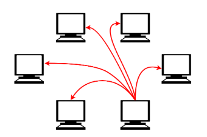
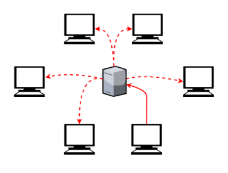

# Group Chats

Instant messaging applications are increasingly becoming places for communities to gather, rather than simply being used for one-on-one conversations. This has led to widespread use of group chats, channels, and similar functionality in messaging applications . Many of the most popular messaging applications support group chats, but the levels of encryption and privacy provided to users in these group chats is often unclear. Group chats in applications such as Telegram and Facebook Messenger only support transport encryption, rather than end-to-end encryption. Even those applications which do support end-to-end encryption in group chats (e.g. Signal and WhatsApp) still use central servers to store and disseminate messages.

There are two key areas to focus on when considering the deployment of encrypted group chats in Session.

## Scaling

There are two main approaches to sending messages in a group chat: server-side fanout and client-side fanout. The choice of method can have a significant impact on the scalability of the group chat.

In client-side fanout, the client individually pushes their message to each recipient device or swarm. Client-side fanout is preferable in some cases since it can be done in peer-to-peer networks and does not require the establishment of a central server. However, client-side fanout can prove burdensome on client bandwidth and CPU usage as the number of group members increase — a factor which proves particularly problematic for mobile devices.

*Figure 1: Client sends message using client-side fanout.*

In server-side fanout, the client typically sends their message to a server, from which the message is pushed out to each of the other clients (the other clients may also fetch the message from the server at a later point in time), which is more efficient for larger groups.

*Figure 2: Client sends message using server-side fanout: Here, the client sends the message to the server (solid red line) and the server then distributes the messages to clients (dotted red lines)*

## End-to-end Encryption

Another factor which impacts group chat scalability is the choice of how to implement end-to-end encryption.

The most naive solution to building group chats in Session would be to simply leverage the existing pairwise sessions we can create for one-on-one conversations. To send a message to a group chat, a pairwise session would be started with every member of the group, and each message would be individually encrypted for each participant. This provides the group chat with the same guarantees possessed by standard pairwise communications using the Signal protocol: perfect forward secrecy and deniable authentication. However, this would come at the cost of requiring the payload to be encrypted and stored N times, where N is the number of members in the group. This process could become burdensome for low-powered clients participating in large group chats.

One way to improve group chats is to adopt the "Sender Keys" system used by WhatsApp. This system involves a set of keys (a Chain Key and a Signature Key) that each client generates for each of its groups. These Sender Keys are shared between all group members in a traditional pairwise manner using the Signal protocol. When a client needs to send a message to the group, it derives a message encryption key using its Chain Key and encrypts the message only once. In Session, this would allow only having to generate proof of work exactly once per message, irrespective of the number of members in a group. The same ciphertext can then be decrypted by all other group members, as they can generate the same message key from the senders' chain key. Note that all future keys can be generated this way by all group members, so no further sharing of keys is necessary. However, all Sender Keys in the group will need to be updated whenever a group member leaves or is kicked from the group to ensure that they won't be able to read future messages. Additionally, this approach has the downside of losing the “self healing” property of the traditional Signal protocol provided in pairwise sessions.

The Sender Keys scheme is effective in small- to medium-sized group chats where the membership set changes infrequently. However, it can be impractical in larger groups, where users frequently leave (or are kicked from) the chat as all Sender Keys must be updated and redistributed in each such event. Further improvements to the Sender Keys scheme have been proposed in the draft MLS specification (discussed in Future Work below).

## Other Considerations 
### Group Size

It may be possible to create large encrypted groups that scale well even when members are added and removed frequently. However, the reality of large groups is that as more members are added to the group, it becomes increasingly likely that members will leak or otherwise share the contents of the conversation. Identifying and removing a malicious or compromised group member in a very large group is difficult, and thus, perfect forward secrecy and deniability would be violated in such cases, unless malicious users could be identified and removed.

### Proof of Work 

A small proof of work must be produced for each new message which is sent offline and stored in a swarm (see Spam below). In a case where many group members are offline at the same time, the sender must calculate many such proofs of work before their message can be delivered to all members of the chat, this quickly becomes taxing on mobile devices.

### Metadata Protection

Information about a group chat, including the public keys of members, administrators, and the IP addresses of users, should be kept private by participants, as public availability of information about the relationships between public keys significantly reduces privacy

### Group Type Comparisons

With the above considerations in mind, Session deploys two different schemes for the encryption and scaling of group chats, with scheme selection based on group size.

#### Closed Groups 3 - 500 Members

To initialise a closed group chat, a user selects a number of users from their contacts list. The user's client sends a control message through a pairwise channel to the selected users. This control message communicates the group name, group members, group avatar, and other relevant data about the group. If the group chat includes users who have not previously communicated with each other, sessions are established between these users in the background.

Using these pairwise channels, the group derives shared ephemeral encryption and signing keys. This ensures messages only need to be encrypted once for the entire group, as per the Sender Keys scheme detailed above. Instead of communicating these encrypted messages to each user in the group individually, the group chooses a random swarm to store non-pairwise messages. This ensures messages are only stored on a single swarm, regardless of group size.

Onion requests are used for transmitting messages to and from the shared swarm, and also used any time pairwise communication is required.

#### Closed Group Administration

The creator of a closed group becomes the administrator of that group. All users added to the group have rights to add new members, but users can only be kicked from the group by the administrator. This information is shared through pairwise channels when the group is created, and sent via a pairwise channel to new members when they join the group.

#### Open Groups 

Large closed groups run into significant scaling issues when members leave the group, as keys must be re-derived and redistributed to the entire group — an inefficient process when there may be hundreds or thousands of members. Additionally, as previously addressed, the usefulness of end-to-end encryption in very large groups is unclear, since a single malicious group member or compromised device is catastrophic to group privacy, and in large groups this is extremely difficult to protect against, regardless of the degree of encryption deployed. In Session, once group membership reaches the upper bound for closed groups, the administrator is encouraged to convert the group into an open group. open groups revert to transport-only encryption, which protects users against network adversaries but provides comparably weak protection against server-side attacks.

To balance the risk of such attacks, Session's open groups do not use the Service Node architecture. Open groups instead require group administrators to operate their own server, or arrange for a channel to be created on an existing open group server host. The software required to do this is open-source, and a reference implementation is provided. All messages and attachments stored on open group servers are fetched and posted through onion requests using the IP address or domain name of the open group host server, preserving network-layer anonymity for participants.

#### Open Group Administration

Administration of open groups is comparably more complex than that of closed groups. The open group server operator is the original administrator, and they are able to add new administrators. All administrators have the right to delete messages from the server. Joining rights to open groups falls into one of two categories: whitelist-based groups and blacklist-based groups. Whitelist-based groups require each user's public key to be preapproved (added to the whitelist) by an administrator, and users must be invited before being able to join the open group. Blacklist-based groups can be joined by any user who knows the domain/IP address of the group, but users can be banned if an administrator adds their public key to a list of banned public keys (the blacklist).
