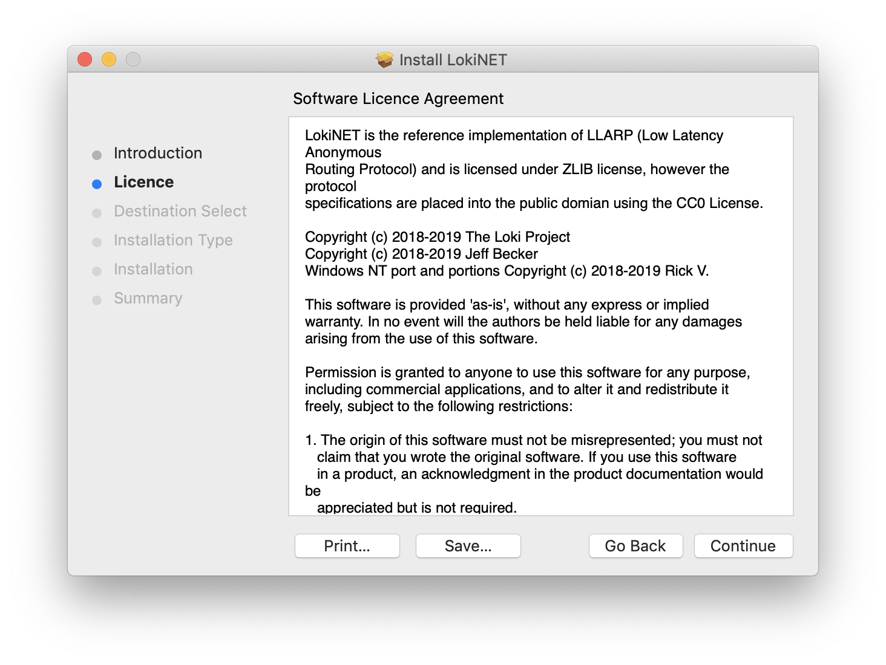
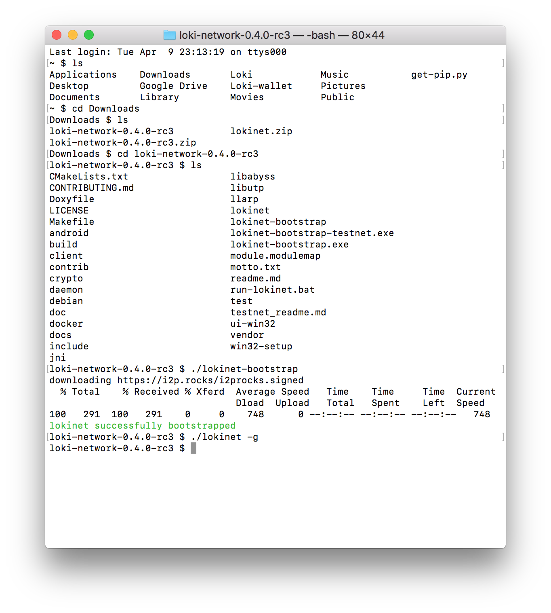
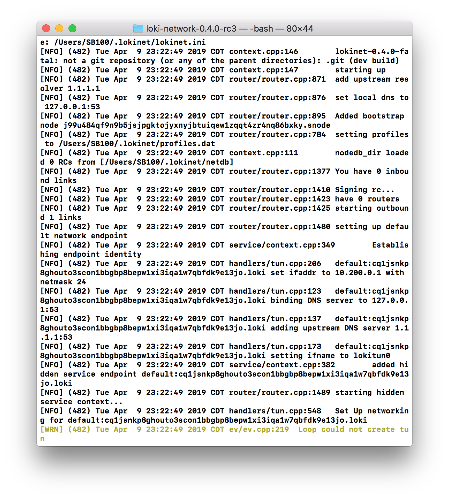
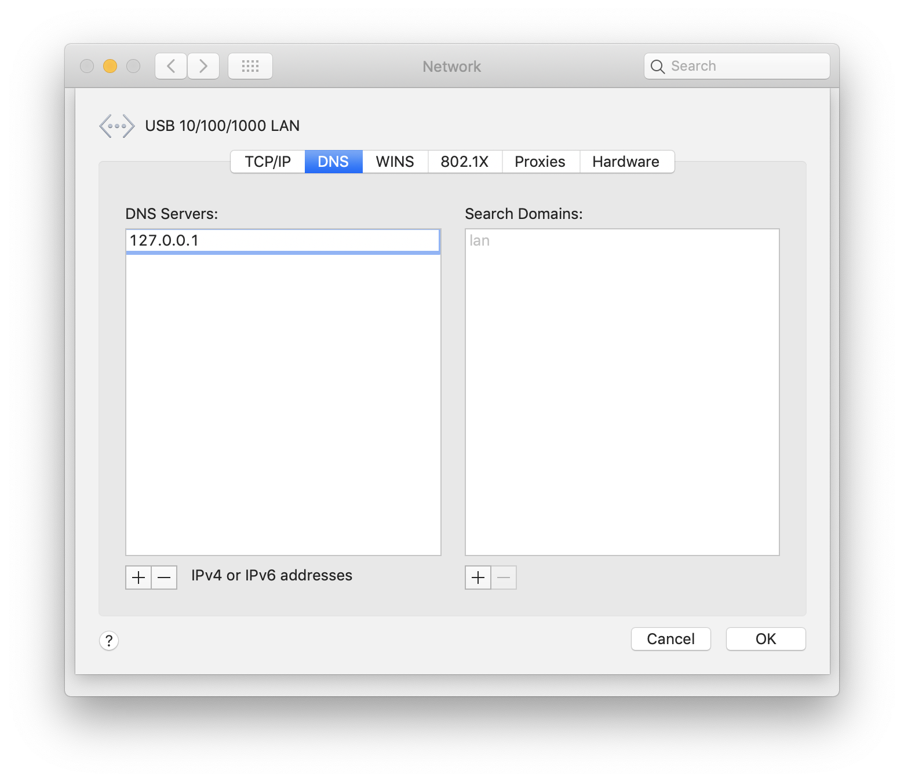

# Lokinet install guide - MacOS 

**Use this video guide [https://www.youtube.com/watch?v=_ILAISdswLg](https://www.youtube.com/watch?v=_ILAISdswLg) for installation instructions.**

## 1. Download the latest release

Head to [lokinet.org](https://lokinet.org/), download the latest MacOS Lokinet release and run it. 

## 2. Install lokinet software



## 3. Open terminal

Open the terminal and change directory to `usr/local/bin`:

```console
cd /usr/local/bin
```


## 4. Generate configuration file

Enter into the terminal to generate the configuration file:

```console
./lokinet -g
```



## 5. Run the Lokinet MacOS Binary

Finally you're going to run Lokinet. To do that enter into the terminal:

```console
./lokinet
```



## 6. Configure DNS

If DNS is not configured automatically, you can do it manually. 
Go to `System Preferences -> Network -> Advanced -> DNS`

Click on `+` in DNS servers list. Enter `127.0.0.1` as a DNS address:




## 7. Done!

You should now be connected. Enter a .loki address into a browser and enjoy navigating lokinet!


