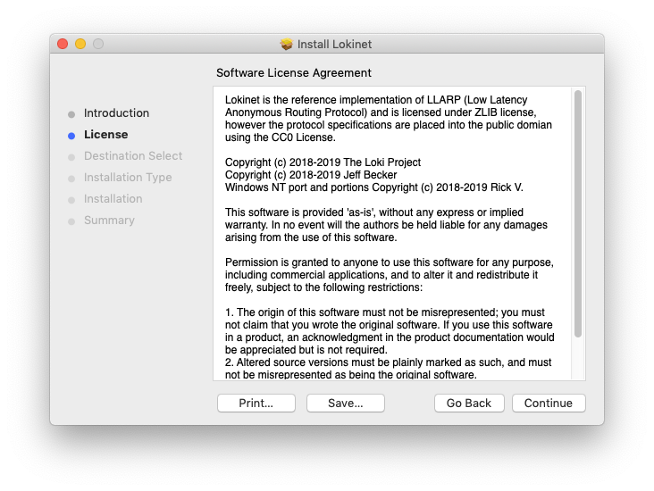

title: Loki Documentation | Lokinet MacOS Install Guide | Onion Routing
description: This guide walks you through the steps to get Lokinet, a new onion router with sybil resistance properties, working on MacOS.

# Lokinet install guide - MacOS 

## 1. Download the latest release

Head to [lokinet.org](https://lokinet.org/), download the latest MacOS Lokinet release and run it. 

## 2. Install lokinet software

### 2.1 Permissions

First, try and open the lokinet Mac software you just downloaded. It will most probably cause a security error.


If this error occurs, go into your System preferences and search for Security.

Now jump into your Security & Privacy Settings.


Go down to the bottom of this window and allow the Lokinet Mac pkg to run by clicking the `Open Anyway` button.


### 2.2 Install Lokinet
Now continue as with the installation.



## 3. Open the terminal and run the Lokinet MacOS Binary

You now want to run lokinet in your terminal:

```
sudo lokinet
```


## 4. Configure DNS

If DNS is not configured automatically, you can do it manually. 

Go to `System Preferences -> Network -> Advanced -> DNS`

Click on `+` in DNS servers list. 

Enter `127.0.0.1` as a DNS address:

> Note: When adding our new DNS address make sure it is above your old one. 


---

## 5. Troubleshooting
### Can't access `<string>`.loki addresses. 

This can be fixed by making sure your DNS is configured properly. See [step 4](#4-configure-dns).

## 6. Done!

Well done, you have finished the guide. Jump back into the [Lokinet Public Testing Guide here](../PublicTestingGuide/#2-accessing-snapps).


