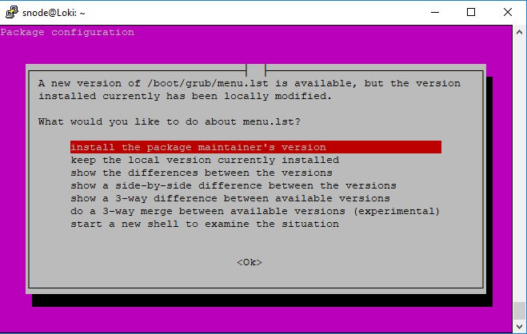

# Update Guide
This document is for Service Node Operators who have used the previous [Service Node Full Guide](../SNFullGuide/) and wish to update the version of their Service Node.

> Note that this update guide is for individuals running their Service Node as a Service on linux. If you are using any `screen`'s you will need kill the screens and go back to the [Service Node Full Guide](../SNFullGuide/) and follow it once more. 

> It is highly recommended running your Service Node as a Service due to the ease of updating. 

## Step 1: Load and Update your VPS.

If you are updating your VPS you would by now have a good understanding of how to log in to your server. If you don't check out how you prepared your server in this guide [here](../SNFullguide/#step-2-prepare-your-server).

Once we have logged in to our VPS we should update our package lists, the below command downloads the package lists from the repositories and "updates" them to get information on the newest versions of packages and their dependencies. It will do this for all repositories and PPAs.

```
sudo apt update
```

You will notice a bunch of package lists were downloaded, once this is complete run the below command to fetch new versions of any packages we currently have installed on the system.

```
sudo apt upgrade
```

You will be prompted to authorise the use of disk space, type `y` and enter to authorise.

If you are prompted during the upgrade that a new version of any file is available then click the up and down arrows until you are hovering over `install the package maintainer’s version` and click enter.

<center></center>

Alright, good to go. Our server is now up to date. On to the fun part!

## Step 2: Download the new Loki Binaries

To download the Linux binaries use the following command:

```
wget <link>
```

Where `<link>` is the download link of the latest linux release. To find the link go to [https://github.com/loki-project/loki/releases/latest](https://github.com/loki-project/loki/releases/latest), right click the latest linux release and click `Copy Link Location`.

Your command should look something like:

```
wget https://github.com/loki-project/loki/releases/download/v3.0.2/loki-linux-x64-v3.0.2.zip
```

To unzip the downloaded zip file run the following command (changing 3.0.2 to whatever version you
downloaded above):

```
unzip loki-linux-x64-v3.0.2.zip
```

You will see something like this:

```
Archive:  loki-linux-x64-v3.0.2.zip
   creating: loki-linux-x64-v3.0.2/
  inflating: loki-linux-x64-v3.0.2/loki-blockchain-ancestry  
  inflating: loki-linux-x64-v3.0.2/loki-blockchain-depth  
  inflating: loki-linux-x64-v3.0.2/loki-blockchain-export  
  inflating: loki-linux-x64-v3.0.2/loki-blockchain-import  
  inflating: loki-linux-x64-v3.0.2/loki-blockchain-mark-spent-outputs  
  inflating: loki-linux-x64-v3.0.2/loki-blockchain-stats  
  inflating: loki-linux-x64-v3.0.2/loki-blockchain-usage  
  inflating: loki-linux-x64-v3.0.2/loki-gen-trusted-multisig  
  inflating: loki-linux-x64-v3.0.2/loki-wallet-cli  
  inflating: loki-linux-x64-v3.0.2/loki-wallet-rpc  
  inflating: loki-linux-x64-v3.0.2/lokid  
```

Note that they are unzipped into the `loki-linux-x64-v3.0.2` folder; you can check they are unzipped by running the following to change into the folder and then listing the files:

```
cd loki-linux-x64-v3.0.2
ls
```

We now want to replace our "symlink" to the new extracted `loki-linux-x64-v3.0.2` folder. If you are unfamiliar with what the "symlink" was doing previously have a look at the [Service Node Full Guide](../SNFullGuide/#step-3-download-the-loki-binaries) where you first set it up.

Otherwise, run the following command.:

```
cd
ln -snf <folder_name> loki
```

Where `<folder_name>` is the new folder we created when unziping the release. In this case if we were to update to `v3.0.2` the commands we would use would be:
```
cd
ln -snf loki-linux-x64-v3.0.2 loki
```

This replaces our virtual `loki` folder that pointed to an old folder to the `loki-linux-x64-v3.0.2` folder we created.

At this point it is wise to restart your system with the following command:

```
sudo reboot
```

Once the system has restarted it will reboot the new version of `lokid`.

Log back in to your VPS and double check the new version of lokid is running smoothly by running the following command:
```
sudo journalctl -u lokid.service -af
```

> *NOTE: If you’re nervous about trusting the binaries or the download link, you should build it from source yourself. Instructions for that can be found in the README of [https://github.com/loki-project/loki](https://github.com/loki-project/loki)*

Excellent! You have now updated your Service Node.

